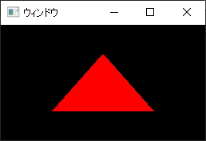

# eseed window
`namespace esd::wnd`



## Goal
A cross-platform, minimal, modern window library for C++17. Designed to support a variety of rendering APIs. Currently includes Vulkan surface management.

## A message from me
Hello everyone. This project is my second library, and began as a part of my game engine. If anyone is interested in contributing a different platform / new render API support, I'd love to work with you! In any case, I'll slowly be adding functionality myself, but it'll take plenty of research :) I hope someone will find this library useful!

## Known bugs
- Win32 window doesn't detect cursor movement outside client frame

## Features
- Current supported platforms
  - Win32
- Current supported rendering APIs
  - Vulkan
- Input handling
  - Event polling and waiting
  - Keyboard
    - Key callback
      - Applicable key codes are mapped to their ASCII analogs
    - Char input callback (Unicode)
    - Key state getter
  - Mouse
    - Cursor position getter and setter
    - Cursor screen position getter and setter
    - Mouse button state getter
    - Mouse move callback
    - Mouse button callback
- Title management (Unicode)
- Size and position management
- Fullscreen

### Planned
- More platform support
  - Mac, Wayland, X, etc. (needs a lot more research on my part, contributions appreciated)
  - More Windows support
    - IME input
- More rendering API support
  - OpenGL context management
  - Possibly others
- More input handling
  - Mouse capturing
  - Controllers / gamepads
  - Additional (needs more research)
- Thread safety
- Sound? (possible)
- Anything else as it comes along :)

## Ghetto temporary documentation

### Basics
Currently, the only supported rendering API is Vulkan, and the only supported platform is Win32. When more platforms are added, effective usage should be exactly the same and completely platform-independent.

Windows are created with a simple constructor taking a title and size. This may be expanded with additional optional parameters in the future.

After the window has been created, it needs to be polled for events continuously.

When the window class goes out of scope or is destroyed, the window itself will be freed and destroyed automatically.

```cpp
#include <eseed/window/window.hpp>

int main() {
  
    // Window creation

    esd::wnd::Window window("Title", { 1366, 768 });

    // Event polling until window closes
    
    while (!window.isCloseRequested()) {
        window.poll();
    }
}
```

### Input handling
Window input can be intercepted by setting the listeners in the window object.

#### Raw Keyboard Input
```cpp
window.keyHandler = [](esd::wnd::KeyEvent e) { ... };
```

Called when a key is pressed or released. `e` contains a key code and a boolean indicating whether it was pressed or released.

Individual key states can also be queried with `.isKeyDown(esd::wnd::Key)`.

Toggleable keys' toggle states (such as caps lock) can be queried with `.isKeyToggled(esd::wnd::Key)`.

Keys

#### Keyboard Char Input
```cpp
window.keyCharHandler = [](char32_t c) { ... };
```

Called for each character generated by one or more keys.

The parameter for this function is a `char32_t`, representing a Unicode code point.

#### Cursor Movement
```cpp
window.cursorMoveHandler = [](esd::wnd::CursorMoveEvent e) { ... };
```

Called while the cursor is actively moving. `e` contains the cursor's window coordinates, as well as screen coordinates.

Cursor position can be checked at any time using `.getCursorPos()` and `.getCursorScreenPos()`.

Cursor position can be set using `.setCursorPos(esd::wnd::Pos)` and `.setCursorScreenPos(esd::wnd::Pos)`.

#### Mouse Button Input
```cpp
window.mouseButtonHandler = [](esd::wnd::MouseButtonEvent e) { ... };
```

Called when a mouse button is pressed or released. `e` contains a button code and boolean indicating whether it was pressed or released.

Individual mouse button states can be queried with `.isMouseButtonDown(esd::wnd::MouseButton)`

### Vulkan support
The `esd::wnd::VulkanWindow` class is a helper class extending the base window class to provide platform-specific Vulkan functionality (surface creation). Both the C Vulkan library and C++ bindings (`vulkan.hpp`) are supported.

To use `VulkanWindow`, the CMake build files must be generated with `-DESD_WND_ENABLE_VULKAN_SUPPORT`.

Make sure to include the Vulkan header before `<esd/window/vulkanwindow.hpp>`.

`VulkanWindow` provides 3 additional functions:
- `std::vector<const char*> getRequiredSurfaceInstanceExtensions()`
- `VkSurface createSurface(const VkInstance& instance)`
- `vk::Surface createSurface(const vk::Instance& instance)` (only if `vulkan.hpp` is included)

```cpp
#include <vulkan/vulkan.hpp>
#include <eseed/window/vulkanwindow.hpp>

int main() {
    // Window creation
    esd::wnd::VulkanWindow window("Title" { 1366, 768 });
    
    // Get required instance extensions for surface creation
    std::vector<const char*> extensions = 
        window.getRequiredSurfaceInstanceExtensions();
    
    // Vulkan instance creation
    vk::InstanceCreateInfo instanceCreateInfo;
    ...
    instanceCreateInfo.setEnabledExtensionCount((uint32_t)extensions.size());
    instanceCreateInfo.setPpEnabledExtensions(extensions.data());
    ...
    vk::Instance instance = vk::createInstance(instanceCreateInfo);

    // Vulkan surface creation with eseed window
    vk::SurfaceKHR surface = window.createSurface(instance);

    ...

    while (!window.isCloseRequested()) {

        ...
      
        window.poll();
    }

    ...
}
```